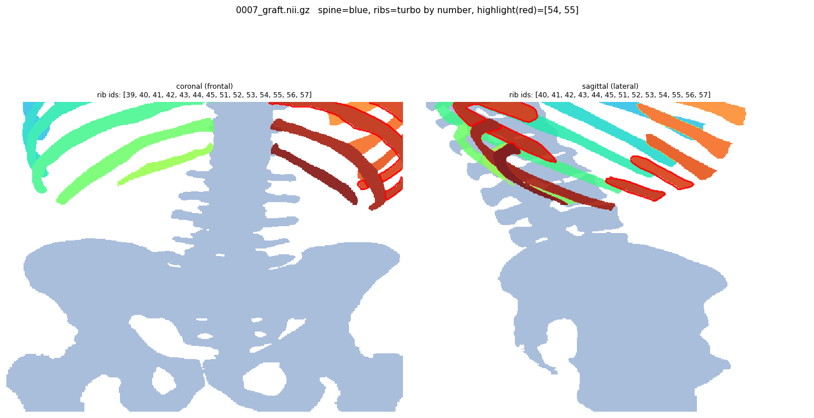
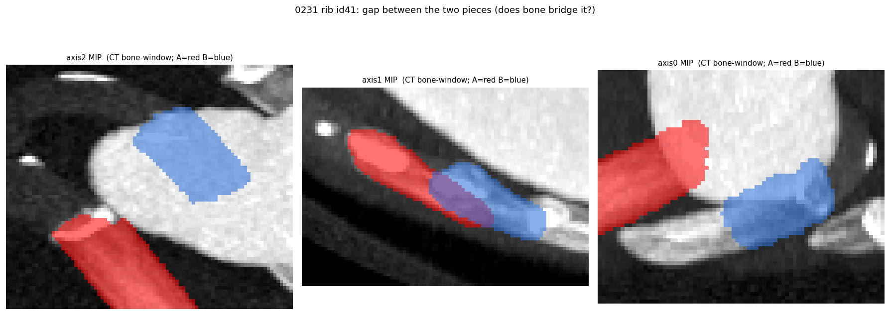
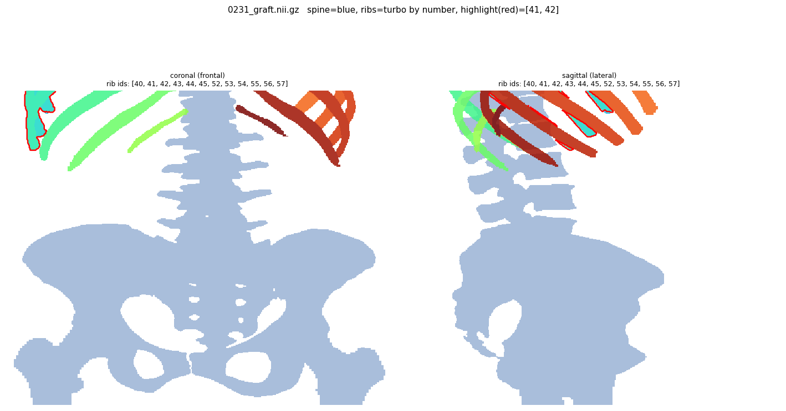

# CTSpinoPelvic1K — v4 Rib Numbering Correction Guide

A short, AI-assisted review task: fix the handful of ribs in **v4** where the
automatic pipeline left a rib **number split across two pieces**. The rib
*levels* are already correct (the dataset has **no missing rib numbers**) — you
are only resolving **duplicates**: one rib number that shows up as two separate
blobs. Most cases take under a minute with nnInteractive.

> **The QC lock:** you **cannot** finish or upload a case until its ribs pass QC.
> Every time you Save, the tool re-checks the ribs; if any rib number is still in
> two pieces the case is **LOCKED** — not saved as resolved, not uploaded. See §5.

---

## 1. What you are fixing (30 seconds)

The build trusts TotalSegmentator's rib numbering (which is reliable level-to-level)
and only repairs it. The one residual error is a **DUPLICATE**: a single rib
number (e.g. "left rib 8") appears as **two disconnected pieces**. There are two
flavors, told apart by how far apart the pieces are:

| flavor | how it looks | what it really is | your fix |
|---|---|---|---|
| **Mislabel** (pieces **far** apart, ≥ ~25 mm) | two separate rib arcs, often one out near the lung | **two different ribs** wrongly sharing one number | **relabel** the wrong piece to its correct number (or **delete** it if it isn't a rib) |
| **Split** (pieces **close**, < ~25 mm) | two chunks near the spine | **either** one rib broken in two **or** two adjacent ribs sharing a number | **look at the CT and decide:** one rib → **weld**; two ribs → **relabel** |

There are **no gaps** to fix (no missing numbers) — only duplicates. The QC
message in the terminal tells you the side, the rib number, the gap in mm, and
the likely fix.

---

## 2. Examples

**Mislabel — far apart (case 0007, "right rib 9", ~92 mm).**
The two pieces are ~9 cm apart with **lung between them** — they are clearly two
different structures. One is the real rib 9; the other is a neighbour mislabelled
9. → **Relabel the wrong piece** to its correct number (or delete it).


**Split / ambiguous — close (case 0231, "left rib 8", ~13 mm).**
Zoomed on the gap (CT bone window; the two pieces are red and blue). A small gap
does **not** guarantee one broken rib — here the red and blue are actually **two
different rib arcs** near the spine, so this is a **relabel**, not a weld. If
instead the two pieces were the **same arc, end-to-end**, you would **weld** them.


Whole-cage view of the same case (the flagged rib ringed) for context:


---

## 3. Setup (once)

```bash
pip install requests huggingface_hub numpy nibabel scipy   # scipy is REQUIRED
hf auth login                                              # your own HF login
# ITK-SNAP on PATH, with the AI-assisted (nnInteractive / DLS) backend configured
```

`scipy` is mandatory: the rib QC needs it, and a case that **can't** be QC-checked
is treated as failing (**fails closed**) — it will not upload.

---

## 4. Do a case, step by step

1. **Launch the gated review** (the `--check ribs` flag is required — the default
   is `spine`):
   ```bash
   reviewtool review-cases --check ribs --tokens <ids>        # add --push to upload as you go
   ```
   (Tokens to review come from the rib worklist; `--push` needs write access.)

2. The case opens in **ITK-SNAP** with the locked palette. **Read the QC line in
   the terminal** — it names the rib, the gap, and the suggested fix, e.g.
   `X left rib 8: two pieces 13 mm apart -> if ONE broken rib, weld the pieces; if
   TWO different ribs, relabel the wrong one`.

3. **Find the flagged rib** and look at **both** of its pieces on the CT (scroll
   coronal and sagittal). Ask: *is this one rib in two pieces, or two ribs?*
   - Same arc, end-to-end, just interrupted → **one rib**.
   - Two parallel arcs / one piece sitting at a different level → **two ribs**.
   - A piece that isn't a rib at all (transverse process, bowel, calcification) →
     **not a rib**.

4. **Fix it with the AI-assisted (nnInteractive) tool — do not hand-trace:**
   - **Weld** (one broken rib): scribble across the gap with **that rib's label**
     so the two pieces become one connected piece.
   - **Relabel** (two different ribs): paint the wrong piece with its **correct
     rib number** (count from the neighbours).
   - **Delete** (not a rib): set the stray piece to background (0).

5. **Save** (Ctrl-S, over the `seg.nii.gz` it opened). The QC re-runs automatically.

6. **Result:**
   - **PASS** → quit ITK-SNAP → the case is **resolved** (and **uploaded** if you
     ran with `--push`).
   - **FAIL** → it stays **LOCKED**; you'll be prompted to reopen and keep fixing.

---

## 5. The lock — you cannot upload a bad scan

This is enforced in code, not by trust:

- On every Save the rib QC runs on the **saved file**. A case is kept as
  **resolved** (and eligible for upload) **only if it PASSES** — no duplicate rib
  numbers remain.
- If it still fails, the tool prints `[LOCKED] … NOT saved as resolved, NOT
  uploaded` and offers to reopen. If you decline, the local corrected copy is
  **deleted**, so the case is **neither uploaded nor counted** and simply
  **re-opens on the next run**.
- `--push` only uploads labels that **passed** (the failed ones no longer exist
  locally).
- If the QC can't run at all (e.g. `scipy` missing), the case is treated as
  **failing** (fails closed) and locked.

So a case that doesn't pass QC **physically cannot** be marked done or pushed. If
you can't resolve one, just quit at the lock prompt — it returns next time.

---

## 6. One-paragraph summary

Run `reviewtool review-cases --check ribs`. Each flagged case has one rib number
in two pieces. Read the QC hint, look at the CT: if it's **one broken rib**, weld
the pieces with nnInteractive; if it's **two different ribs**, relabel (or delete)
the wrong piece. Save — the QC re-checks and only lets you finish/upload once the
ribs are clean. You can't upload a failing case.
